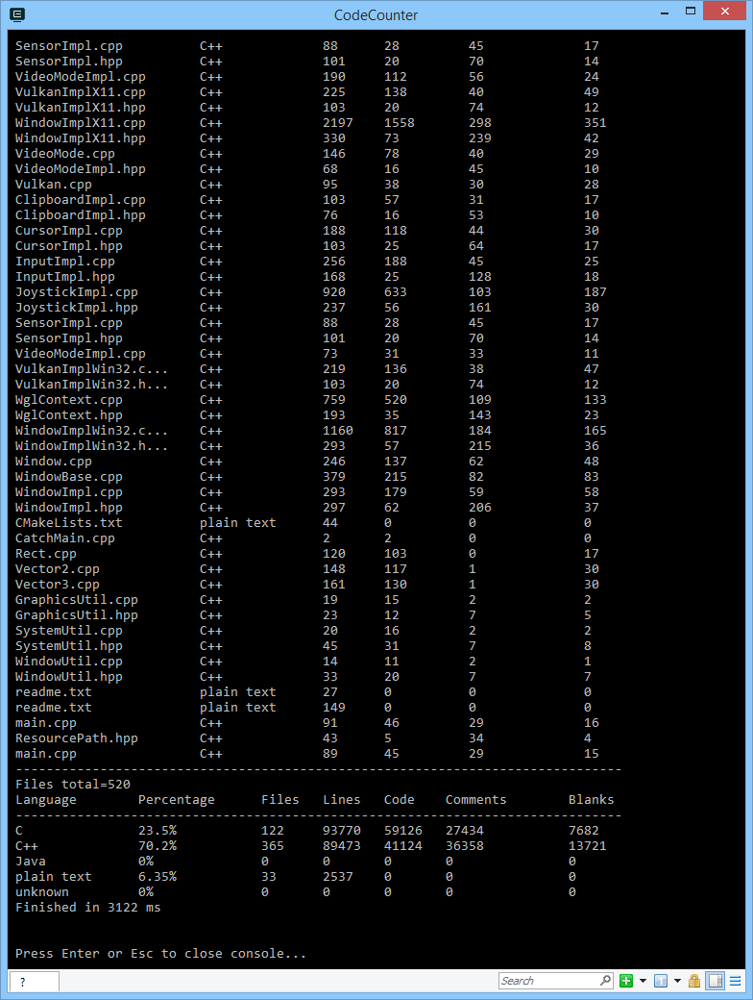

# CodeCounter
A convenient code counting tools to provide a statistic for your project.
## Build
This is a C++ project based on ``Visual Studio 2019`` solution. To build from source, a ``C++17`` compatible compiler is required. 
## Run
Basic Usage: [optional flags] "[optional path]"
- optional flag:
  - -r **(default)**: recursively read all the (source) files inside ``path``. If ``path`` is not given, the process is done in the current directory of the exectuable.
  - -d **(default)**: show detailed information of all the (source) files read
- optional "path": if specified, read the source files under ``path`` instead of the current directory of the exectuable. Must be quoted.

## Example
An example showing statistics of the ``SFML`` source code.

## Additional notes
This is a small projects for me trying some new things:
- ``std::filesystem`` in ``C++17``
- enum class hacks
- ``std::unordered_map``
- precompiled headers